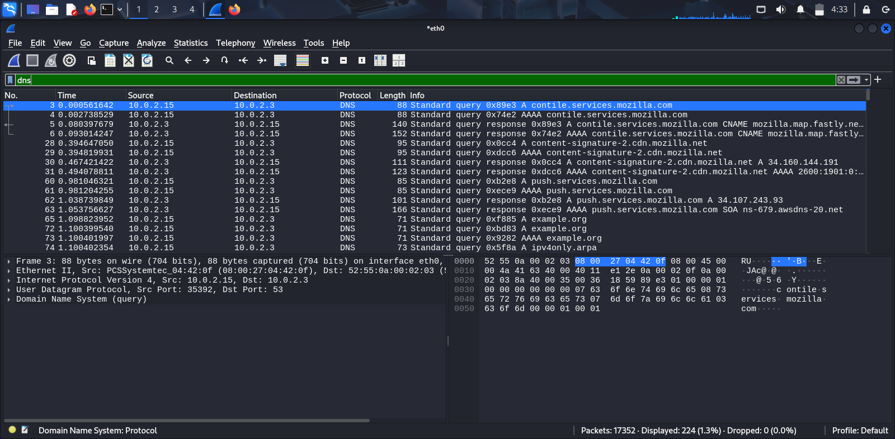
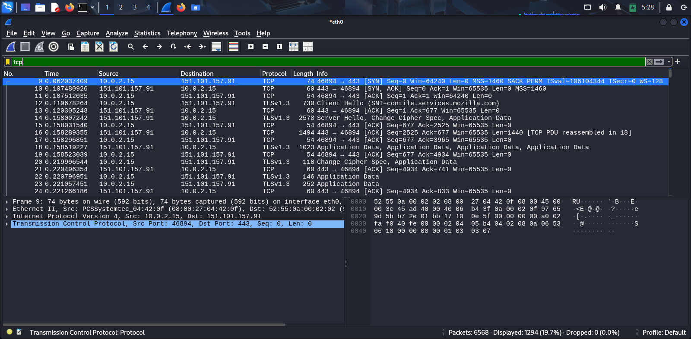
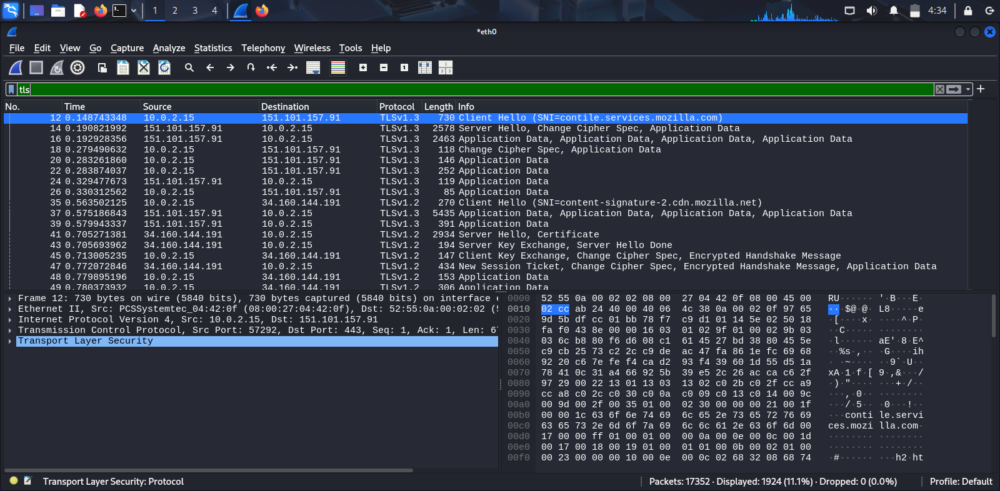
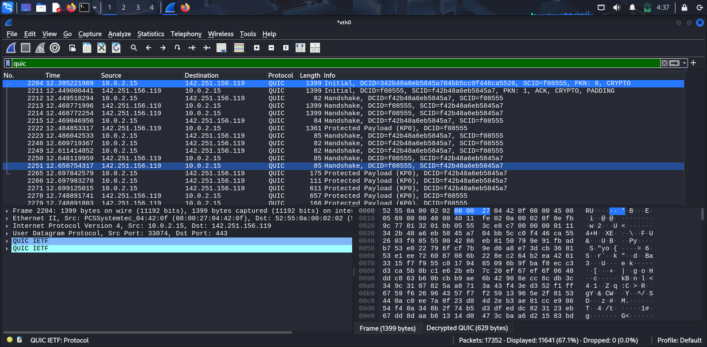
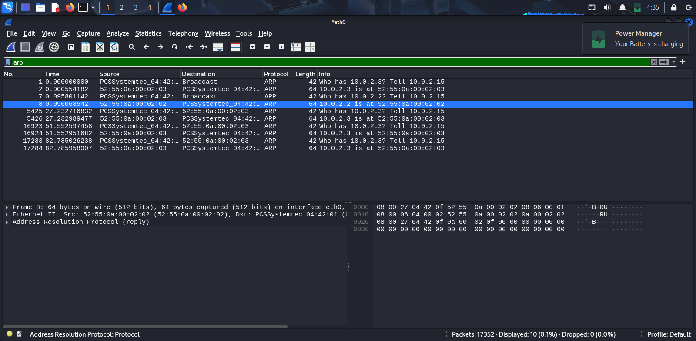

# Wireshark Traffic Analysis

## Overview
This project demonstrates basic network traffic analysis using Wireshark.

The objective was to capture and analyze different network protocols and understand how systems communicate across a network.

## Protocols Analyzed
- DNS
- TCP
- TLS
- QUIC
- ARP

## Analysis Summary

### DNS Analysis
Observed DNS queries and responses generated during website access.

### TCP Analysis
Analyzed TCP connections and packet exchanges between client and server.

### TLS Analysis
Examined encrypted HTTPS traffic and TLS handshakes.

### QUIC Analysis
Captured QUIC traffic used by modern web applications.

### ARP Analysis
Observed ARP requests and responses used for MAC address resolution.

## Tools Used
- Wireshark
- Windows 11

## Author
Abhimanyu C
